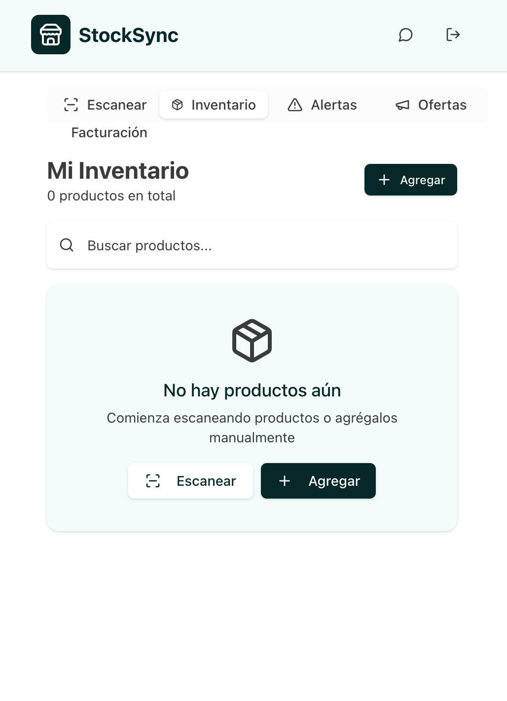
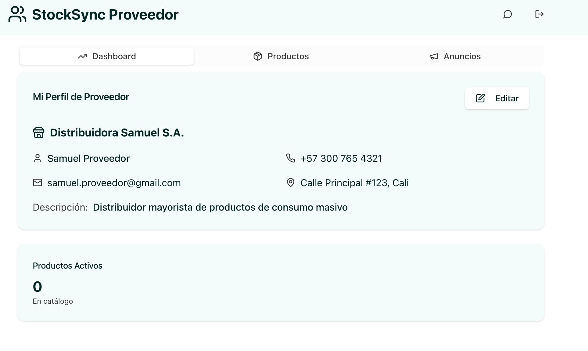
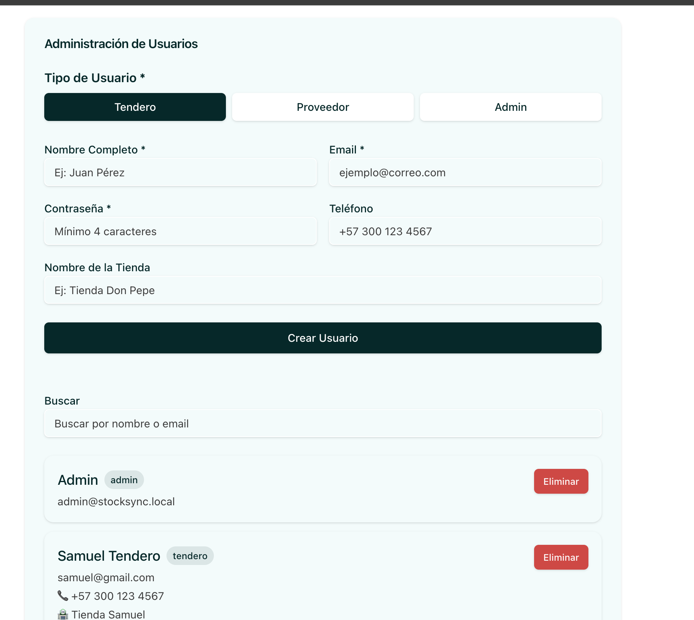
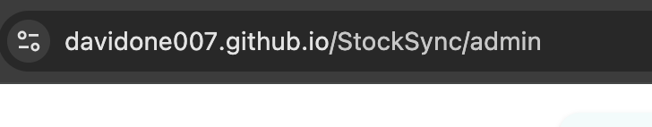

# StockSync — Demo orientada a clientes

Demo pública: https://davidone007.github.io/StockSync/

StockSync es una demo de aplicación web para gestión de inventario y comunicación entre tenderos y proveedores. Está pensada para presentaciones comerciales y pruebas: los datos se guardan en `localStorage` y la demo incluye usuarios de ejemplo, catálogo y flujos de compra/venta.

## Características principales
- Gestión de productos y stock
- Chat entre tenderos y proveedores
- Anuncios y ofertas
- Importación de códigos de barras
- Interfaz moderna con Next.js y TailwindCSS

Imágenes (capturas de la demo):


*Vista de la interfaz para tenderos (busqueda, catalogo, ventas).* 


*Panel del proveedor: publicar ofertas y gestionar catálogo.*


*Panel de administración: crear/gestionar cuentas.*


*Acceso a la demo pública (GitHub Pages).* 

## Requisitos
- Node.js >= 18
- npm >= 9

## Instalación

```bash
npm install
```

## Ejecución en desarrollo

```bash
npm run dev
```

La app estará disponible en [http://localhost:3000](http://localhost:3000)

Demo online (GitHub Pages)
- URL pública: https://davidone007.github.io/StockSync/
- Administrador: https://davidone007.github.io/StockSync/admin

Nota: el deploy en GitHub Pages ya incluye una versión estática de la demo; muchas funciones dependientes de la cámara o APIs locales (ej. escaneo por webcam) pueden comportarse de forma diferente según el navegador.

## Compilar para producción

```bash
npm run build
npm start
```

## Scripts útiles
- `npm run dev`: Ejecuta la app en modo desarrollo
- `npm run build`: Compila la app para producción
- `npm start`: Inicia la app en modo producción
- `npm run lint`: Ejecuta el linter

Credenciales por defecto (demo) — usa estas cuentas si no quieres crear usuarios:

- Admin
	- Email: `admin@stocksync.local`
	- Password: `admin`
- Tendero (cliente)
	- Email: `samuel@gmail.com`
	- Password: `1234`
- Proveedor
	- Email: `samuel.proveedor@gmail.com`
	- Password: `1234`

Estas cuentas se inicializan por defecto en el estado al primer arranque (ver `lib/utils.ts`).

## Estructura del proyecto
- `app/`: Páginas y lógica principal
- `components/`: Componentes reutilizables
- `data/`: Archivos de datos (ej. CSV, JSON)
- `lib/`: Utilidades
- `public/`: Archivos públicos

## Tecnologías
- Next.js
- React
- TailwindCSS
- Radix UI
- Lucide Icons
- Zod
- PapaParse
- Recharts

## Autor
Proyecto universitario - Icesi

¿Quieres que coloque otras imágenes o que cambie el texto de la demo para un cliente en particular? Dime qué sección quieres destacar (por ejemplo: 'Escaneo con cámara', 'Generar facturas' o 'Chat entre tiendas') y lo incluyo en el README con más capturas o pasos.
